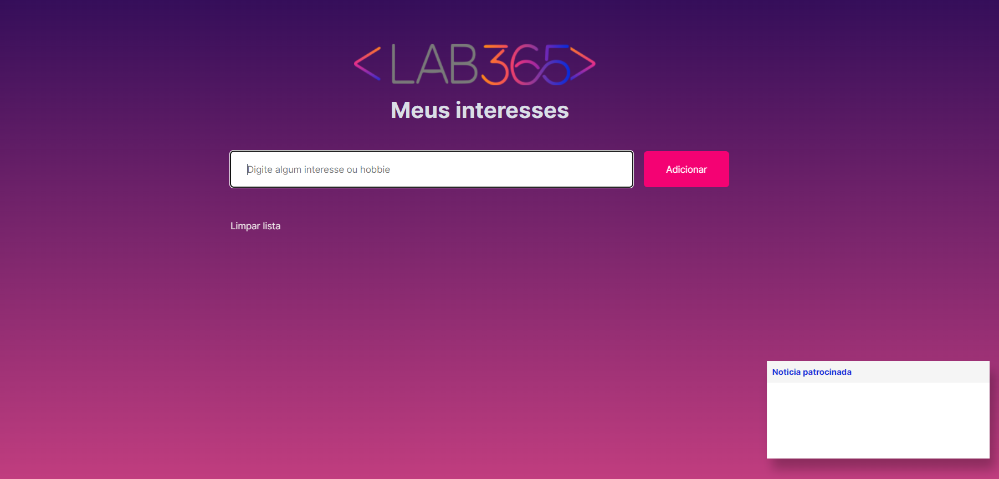

# Meus Interesses

Página para adicionar nossos interesses e hobbies, sendo possível armazenar os dados para ter acesso a qualquer momento. Ele consistirá em escrever e adicionar o interesse. 

Também, temos uma seção de notícias de destaque do dia, parecido como um “card” de anuncio patrocinado através do consumo de Api na url:
https://servicodados.ibge.gov.br/api/v3/noticias/?tipo=release

### Exercício curso Futuro DEV, semana 05, módulo 2

## Tecnologia ultilizadas

HTML,manipulação do DOM , CSS , eventos,consumo de API e LocalStorage.

## Como rodar o projeto

#### Clone este repositório em sua máquina local:

git clone https://github.com/FernandaBarrosLinhares/Meus-interesses

Abra o arquivo no VSCode e para visulaizar clique no arquivo index.html com botão direito para abrir a url

## Desenvolvedora

- Fernanda Linhares (https://www.linkedin.com/in/fernanda-linhares-b10ba32b/)
